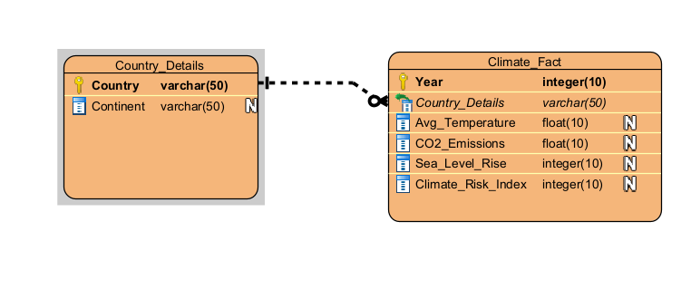
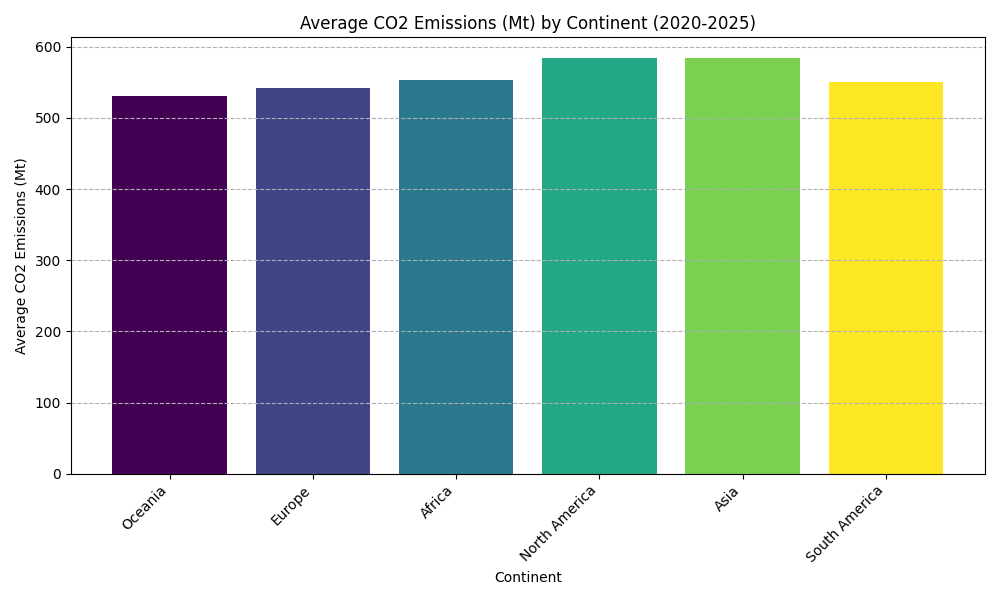
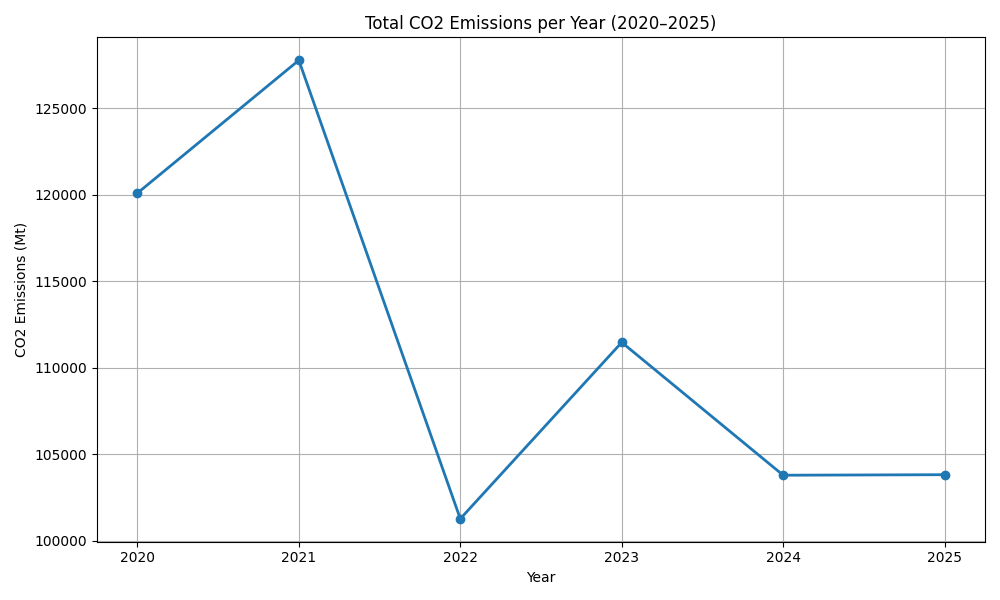
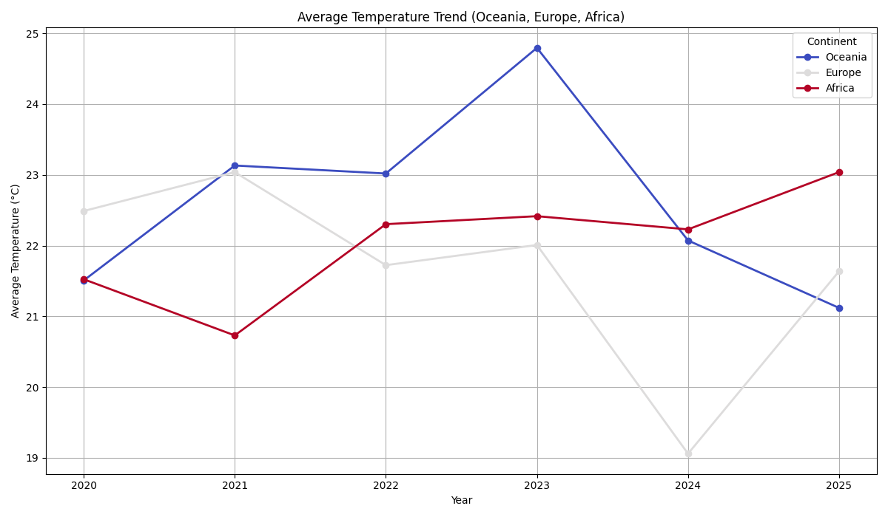
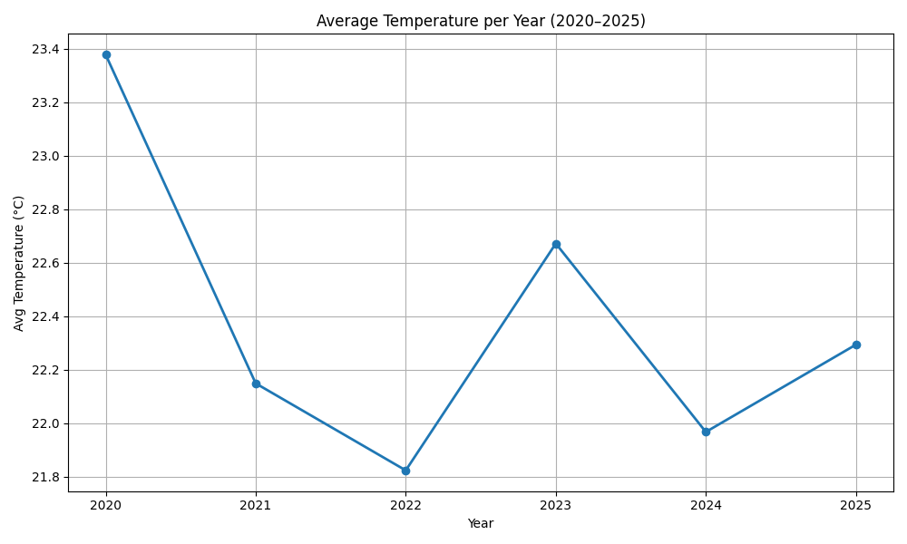
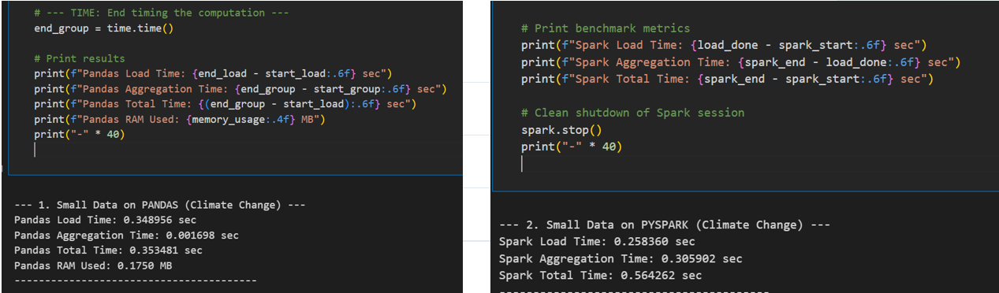
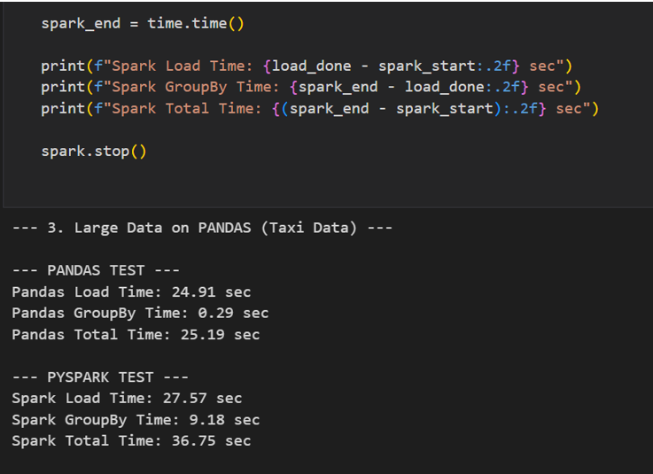
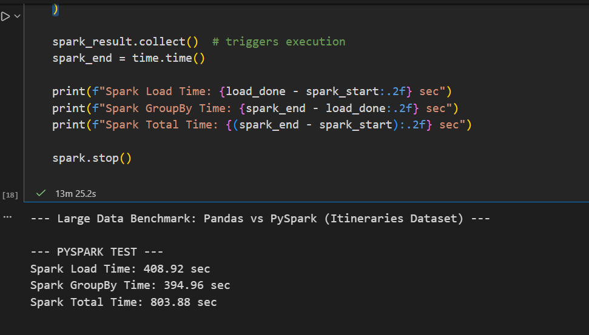
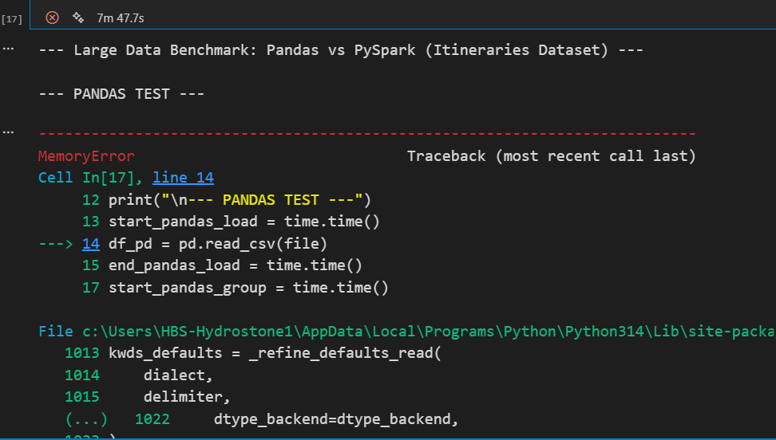

# Climate Analytics and Big Data Processing

## Project Overview

This project demonstrates an end-to-end data analytics workflow using Python, Pandas, NumPy, and Apache Spark. The analysis was conducted across three datasets of varying size and complexity, combining database design principles, data cleaning, visualization, business intelligence, and big data performance evaluation.

The project was designed to answer meaningful business questions, generate actionable insights, and evaluate the scalability of modern data processing frameworks when handling increasingly large datasets.

---

## Objectives

- Design a normalized database model using Third Normal Form (3NF)
- Clean and prepare real-world datasets for analysis
- Perform statistical analysis using Python, Pandas, and NumPy
- Generate visualizations to identify trends and patterns
- Extract business insights from climate data
- Compare Pandas and Apache Spark performance across multiple data scales
- Evaluate memory consumption and processing efficiency for big data workloads

---

## Datasets

### Global Climate Change Dataset (2020–2025)

- Small dataset (~1 MB)
- Used for normalization, data wrangling, statistical analysis, and visualization

### NYC Taxi Trip Dataset

- Medium dataset (~1.6 GB)
- Used for performance and scalability testing

### Flight Itineraries Dataset

- Large dataset (>30 GB)
- Used to evaluate big data processing capabilities and framework limitations

Datasets were obtained from Kaggle and are not included in this repository due to size constraints.

---

## Technologies Used

- Python
- Pandas
- NumPy
- PySpark
- Apache Spark
- Matplotlib
- Jupyter Notebook
- Visual Paradigm

---

## Database Design

The climate dataset was normalized into Third Normal Form (3NF) to eliminate redundancy and improve data integrity.

### Entity Relationship Diagram (ERD)



### Entities

#### Country_Details

- Country ID
- Country Name
- Continent

#### Climate_Fact

- Year
- Average Temperature
- CO₂ Emissions
- Sea Level Rise
- Climate Risk Index

The design removes transitive dependencies and follows relational database best practices.

---

## Data Preparation

Data preparation activities included:

- Missing value detection
- Mean-value imputation
- Data standardization
- Risk category generation
- Feature engineering
- Statistical aggregation
- Data validation

---

## Visual Analytics

### Average CO₂ Emissions by Continent



### Global CO₂ Emission Trends



### Temperature Trends Across Continents



### Temperature Trends by Year



Key findings showed that Asia and North America were among the largest contributors to average CO₂ emissions, while several high-risk regions demonstrated steadily increasing temperature trends.

---

## Business Insights

The analysis answered ten managerial and strategic questions, including:

- Which regions exhibit the highest climate risk?
- Which continents contribute most to global emissions?
- How do temperature trends vary across regions?
- Which areas require the greatest adaptation investment?
- Which regions offer the greatest opportunity for climate improvement initiatives?

These insights demonstrate how data analytics can support policy development, environmental planning, and strategic decision-making.

---

## Big Data Performance Evaluation

A benchmarking exercise compared Pandas and Apache Spark across small, medium, and large datasets.

### Pandas vs PySpark (Small Dataset)



### Pandas vs PySpark (5GB Dataset)



### 30GB Dataset Processing with PySpark



### Pandas Memory Limitation



### Key Results

| Dataset Size | Pandas | PySpark |
|------------|---------|---------|
| Small (~1 MB) | Fastest execution | Slight overhead |
| Medium (~1.6 GB) | Higher memory usage | Stable performance |
| Large (>30 GB) | MemoryError | Successfully completed processing |

### Conclusion

- Pandas performs exceptionally well for exploratory analysis and smaller datasets.
- Apache Spark becomes the preferred solution when data volumes exceed available system memory.
- Spark provides superior scalability and reliability for enterprise-scale workloads.

---

## Repository Structure

```text
data-analysis-and-big-data-processing/
│
├── README.md
├── docs/
│   └── Final.docx
│
├── notebooks/
│   └── Final_Project.ipynb
│
├── images/
│   ├── ERD_screenshot.png
│   ├── Climate visualizations
│   ├── Benchmark screenshots
│
└── presentations/
    └── Climate & Big Data.pptx
```

---

## Skills Demonstrated

- Data Analysis
- Data Wrangling
- Data Modeling
- Database Normalization (3NF)
- Python Programming
- Pandas
- NumPy
- Apache Spark
- PySpark
- Data Visualization
- Performance Benchmarking
- Business Intelligence
- Statistical Analysis

---

## Author

**Promise Jameson**

Database Administration Graduate (Honours Graduate, 95% Program Average)

SQL | Python | Pandas | NumPy | Apache Spark | PySpark | Data Analytics | Business Intelligence